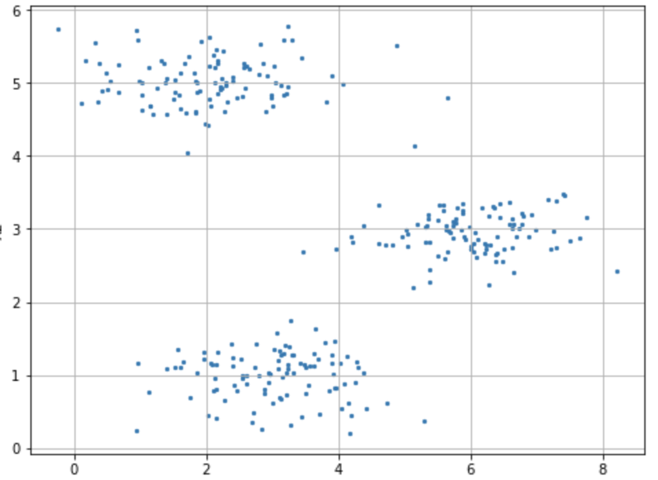
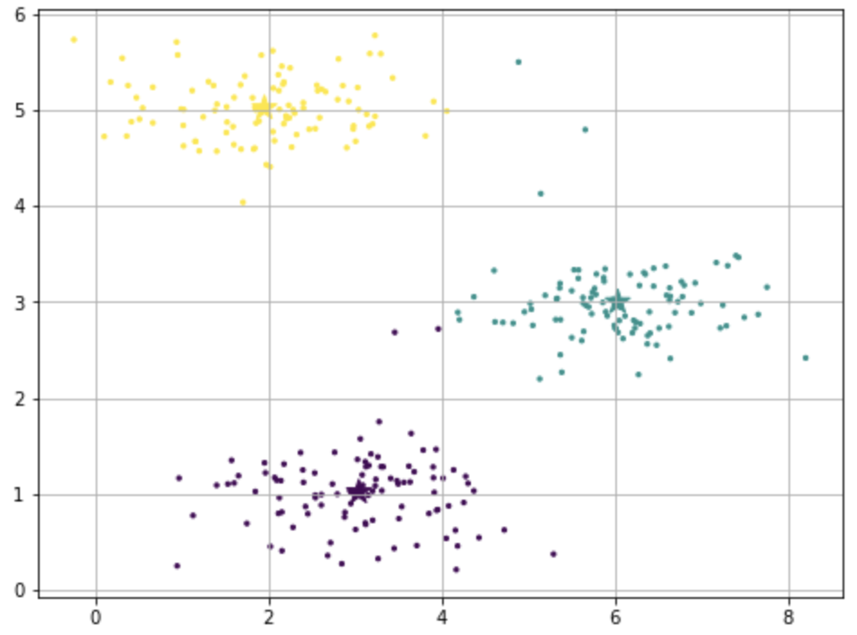
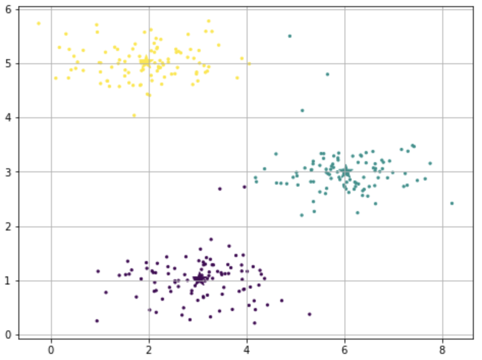
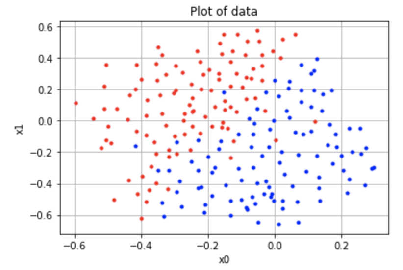
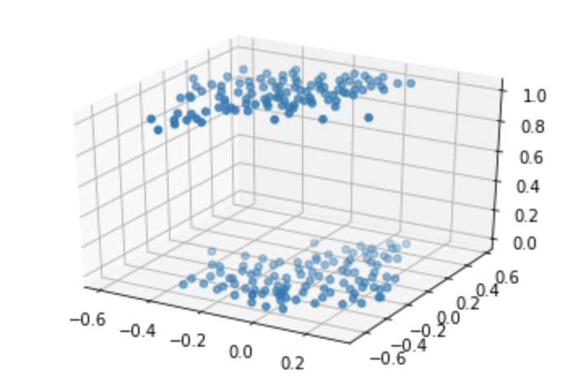
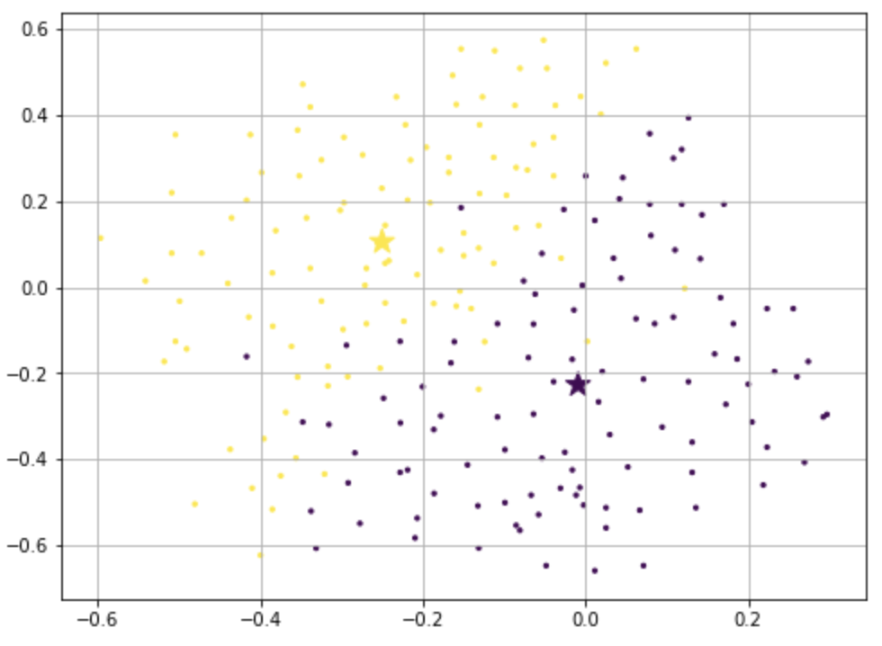

# Kmeans
**-Implementation of Kmeans clustering module**

**-Image compression using kmeans**

Image compression with `n_clusters = 32`:

<p align="center">
   
</p>


To run the project:
```
git clone
jupyter notebook k_means.ipynb
```

Documentation is provided in code comments

## Dataset 1

A visualization of the data provided:

<p align="center">
  
</p>

On visual inspection there appeared to be three distinct clusters, so a `n_clusters = 3` was chosen to run kmeans. To compare the performance of my module, I also ran kmeans using `sklearn.cluster.KMeans`

<p align="center">
   
</p>

On the left is the sklearn module's plot. On the right is the plot generated by the numpy module which I implemented. As we can see, the performance was comparable.

## Dataset 2

This dataset is similar to the dataset used during an earlier regression problem.

A visualization of the data:

<p align="center">
  
</p>

After running the Kmeans algorithm with a cluster size of 2, we obtained the following result:

<p align="center">
 
</p>

Comparing the result to the first graph, we note that the kmeans algorithm correctly grouped the points even across some feature spaces `x1 x2`, as we would expect, surpassing the performance of linear regression in this case.

## Image compression

Our image was compressed with 32 centroid clusters.

Each pixel in the image was converted from color values to a `label` which was the centroid that described the color. The optimal centroid colors were determined by running the algorithm over the 3 features `r g b`. To generate the compressed image, each pixel was re-assigned the color based upon which centroid it's label described.  

Before and after:
<p align="center">
   
</p>
